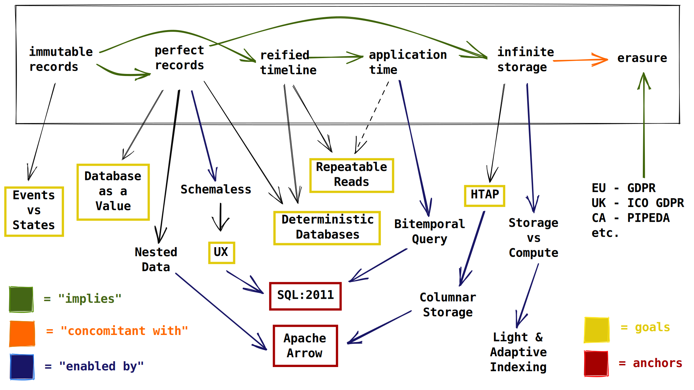

= XTDB Core2 Technical Vision

== Table of Contents

1. Why?
2. What?
3. The Anchors
4. The Pillars
5. User Experience

== Why?

The timing of Core2 is due to the confluence of a number of factors.

* Cloud services are the infrastructure default for new businesses.
* Serverless scalability (including the ability to scale _down_) matters more and more in a fast-paced and unpredictable world economy.
* (Good) developers are expensive.
* Automation means more than doing yesterday's manual tasks in a programmatic fashion tomorrow.
* Clarity and simplicity are forms of automation.
* No database product lives in a vacuum -- predicting which legacy will survive the next 50 years matters.
* Immutable data provides clarity to both developers and businesses but only within the past decade has it become affordable for normal (i.e. not Google) businesses to hold onto all the data they've ever had.
* Storing an ever-growing set of historical data is possible with Object Storage, like Amazon S3.
* Handling an ever-growing set of historical data is a hassle -- dealing with this is a gap.
* Columnar storage is increasingly the norm, even outside of purely analytical applications.
* Immutable data creates a read-only timeline.
* A read-write timeline is called "bitemporal" ... although most developers and businesses do not initially care about writing data into the past and the future, the power and convenience of doing so is underestimated since software systems today must create custom features to allow such behaviour. This is another form of "automated simplicity" -- think Garbage Collectors.
* Bitemporal data requires dynamic structures / shapes / schema.
** These structures must not penetrate the boundary of a _type_. A strict set of types avoids accidental complexity.
* The past 20 years have brought dynamic typing and functional programming into the mainstream. Both are necessary for an immutable database.
** _Dynamic schema_ is a technical constraint. It is necessary to support a read-write (bitemporal) timeline. It's also a cultural constraint. The real world is messy and the database should support the data first and the shape/schema second.
** _Functional programming_ is a social constraint. It is necessary that society (software developers, data scientists, etc.) appreciate the value of immutability and repeatability. If they don't, immutable records will be seen as a luxury.
* The 21st Century brings with it an entirely new world of privacy concerns. Although laws like GDPR and PIPEDA are (arguably) a bare minimum, their existence acts as a forcing function on data tools. Thanks in no small part to GDPR, _erasure_ is non-optional in a modern database.
* Computer languages are hard to get right. Although there are many attractive and modern alternatives to SQL, the SQL family of languages absolutely dominate the landscape of data products in 2022. This isn't going to change any time soon and, thankfully, SQL has a specification.

== What?

That all sounds like a lot.
In some ways, it is.
There is a lot of work required to make Core2 a reality.

The essence of Core2 is a _standards-compliant immutable database_.
The timeliness of technical details, mentioned above, act as pillars to this central ideal.
Although pillars may shift based on product/market fit, it's unlikely any one would be removed or replaced.
If we imagine each pillar as an actual physical column, it will have "faces" which an observer can see by walking around the pillar and looking at it from different angles.

A sketch of the pillars ("features") and ideas which underpin them can be seen here:

Prior to the pillars, however, there are _anchors_.

== The Anchors

Individually, the anchors represent "hard" constraints on the architecture of XTDB Core2.
Together, the space between these anchors represents the flexibility the architecture will need to embrace to support the pillars which follow.

=== SQL Specification

The SQL spec can be used to resolve potentially endless language-design discussions, but it also acts as a voice of (experiential) reason.
It wasn't designed in a vacuum and, although many of its qualities may be unattractive due to its lengthy history, it is common ground for all SQL databases.

For XTDB Core2, the SQL spec acts as a starting point and a home base.
Start with the SQL spec and deviate / append as necessary, preferably with debate in an ADR.
It should not be treated as a backstop.

=== Apache Arrow

The Arrow ecosystem is constantly evolving and it affords a number of advantages.
The rich Arrow type system removes ambiguity around which types Core2 supports.
XTDB Core2's intended future as an HTAP database means data science is an important user base -- playing nicely means a lot.
Core2's usage of Arrow shouldn't ever break promises that a regular Arrow user might come to expect.

== The Pillars

=== Immutable (Temporal)

* transactions require a consistent source of time
* consistent: reads of historical data are always repeatable -- this is Core2's commitment to safety
* deterministic: back doors, modularity, and customization should be actively discouraged, if not forbidden by the design

=== Schemaless / Nested

* target "semi-structured" (realistically, some commonality will exist between rows/documents written in any given time window)
* joins over nested data should not feel "special"

==== Dynamic

* schema "migration" is automatic, from the perspective of the database
* schema is tracked in the database, but implicitly ... every record may have its own schema (although this is unlikely)
* schema is tracked in userland, explicitly ... rather than reconciling program behaviour and schema migrations across a program's timeline (git history, usually), program behaviour and record schema are

TODO: complete this sentence ^

=== Columnar / HTAP

* build to support (slow) arbitrary OLAP queries
* reduce need for ETL
* concede / expect that OLTP frontends are favoured by most users

=== SQL

==== Specification

* treat the specification as a foundation
** Postgres feels like a spec, but prefer the real spec to Postgres
* begin with SQL:2011
* look to SQL:2016 (JSON) and SQL:2023 (PGQ, when it exists) for inspiration

=== Bitemporal / SQL:2011

* this is a "high bar" set early in Core2's development
* working backward from bitemporality (toward a simple immutable experience) means never losing sight of the goal
* bitemporality should be (optionally) invisible to users -- most users do not want it

=== Separation of Storage and Compute

* TODO

=== Erasure (née "Eviction")

* absolute _lowest_ performance priority
** erasure should be respected as it is transacted, to future reads, but can take a long time (on the order of minutes, hours) to actually delete data, since it is only intended for compliance purposes

== User Experience

=== Infra ("DBaaS")

* k8s
* expect to write operators for xtdb, kafka clusters, and object storage
* reuse cloud-provider-managed solutions:
** Kube: EKS / AKS / GKE
** Kafka: MSK / HDInsight / Confluent
** Objects: S3 / Azure Blobs / Google Cloud Storage
** etc.

=== Drivers / Clients / APIs

Be prepared not to have all the answers.
A good user experience is about _iteration_ ... these will all feel somewhat broken at first.

* `pgwire` -- today. a necessary evil (OLTP-shaped txns, json out)
* `FlightSQL` -- hopefully? XTDB team needs to coordinate with Arrow committers
* `HTTP` -- eventually. doing this right requires a lot of careful thought.
** auth
** sessions / stickiness
** content types
** synchronous and interactive transactions? (avoid network hops)
** required for "spin to zero" DBaaS, or can pgwire/FlightSQL talk to a proxy?

==== Synchronous Transactions

* "fork" the db, allow synchronous activities, then "merge" back into upstream
